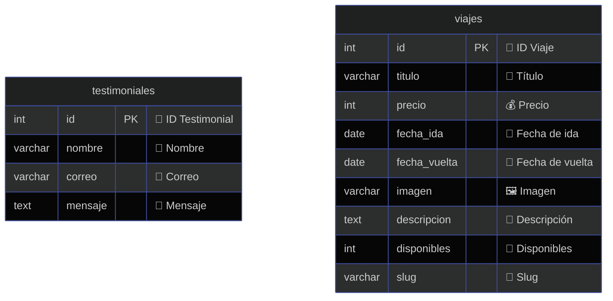

# testiomoniales

## Tablas para usuarios

```mermaid
---
config:
    theme: dark
    themeVariables:
        primaryColor: "#0B1026"         # Azul profundo espacial
        primaryTextColor: "#7B88FF"     # Violeta brillante
        primaryBorderColor: "#3D4B94"   # Azul medio
        lineColor: "#6E3CBC"           # Violeta neón
        secondaryColor: "#251D3A"      # Violeta oscuro
        tertiaryColor: "#2A2356"       # Violeta profundo
        edgeLabelBackground: "#0B1026"  # Fondo etiquetas
        clusterBkg: "#151937"          # Azul noche
        titleColor: "#7B88FF"          # Violeta brillante
        nodeTextColor: "#B4C6FF"       # Azul claro
        nodeBorder: "#3D4B94"          # Azul medio
        labelTextColor: "#7B88FF"      # Violeta brillante
        labelBoxBkgColor: "#151937"    # Azul noche
        labelBoxBorderColor: "#3D4B94"  # Azul medio

---

erDiagram
    %%diseñar la tabla testimoniales usuarios
    
    testimoniales{
        int id PK "🔑 ID Testimonial"
        varchar nombre "👤 Nombre"
        varchar correo "📧 Correo"
        text mensaje "📝 Mensaje"
    }
        %%    CREATE TABLE viajes.usuarios 
    viajes{
        int id PK "🔑 ID Viaje"
        varchar titulo "🚗 Título"
        int precio "💰 Precio"
        date fecha_ida "📅 Fecha de ida"
        date fecha_vuelta "📅 Fecha de vuelta"
        varchar imagen "🖼️ Imagen"
        text descripcion "📝 Descripción"
        int disponibles "🔢 Disponibles"
        varchar slug "🔗 Slug"
    }

    
    %% Definición de relaciones con iconos
%%    ENCARGOS ||--o{ COCHES : "🚗 pertenece"
    
    
        
```

